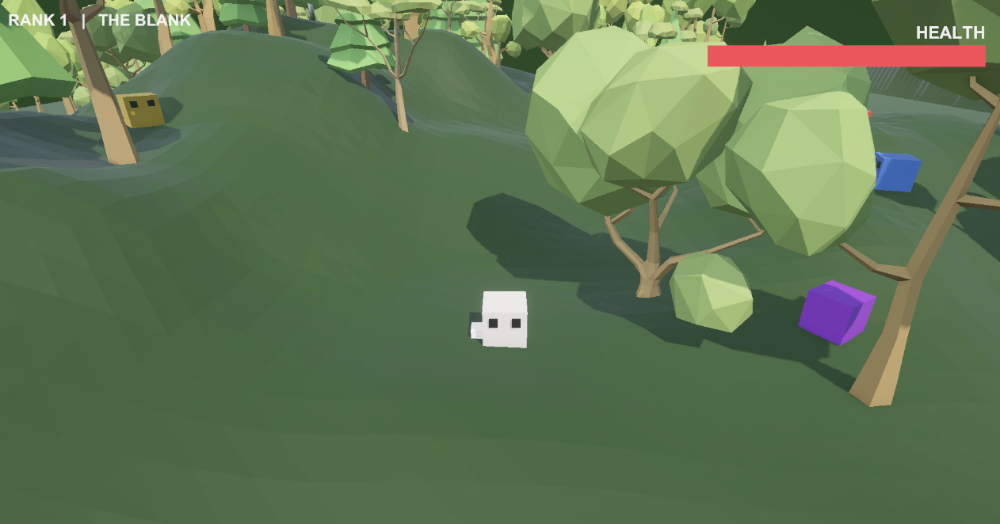
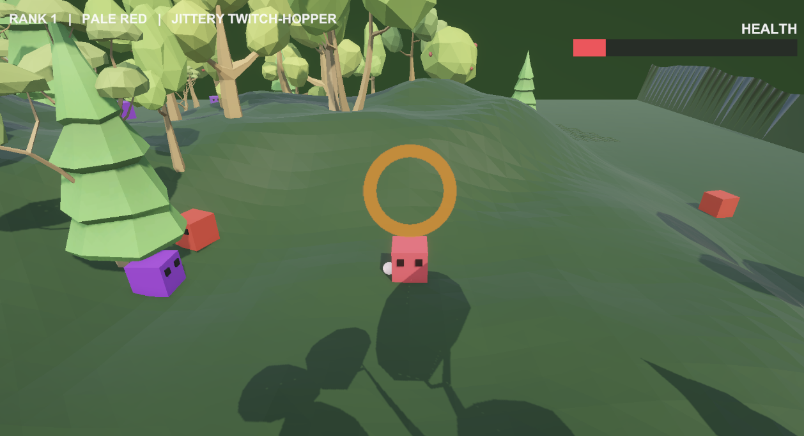
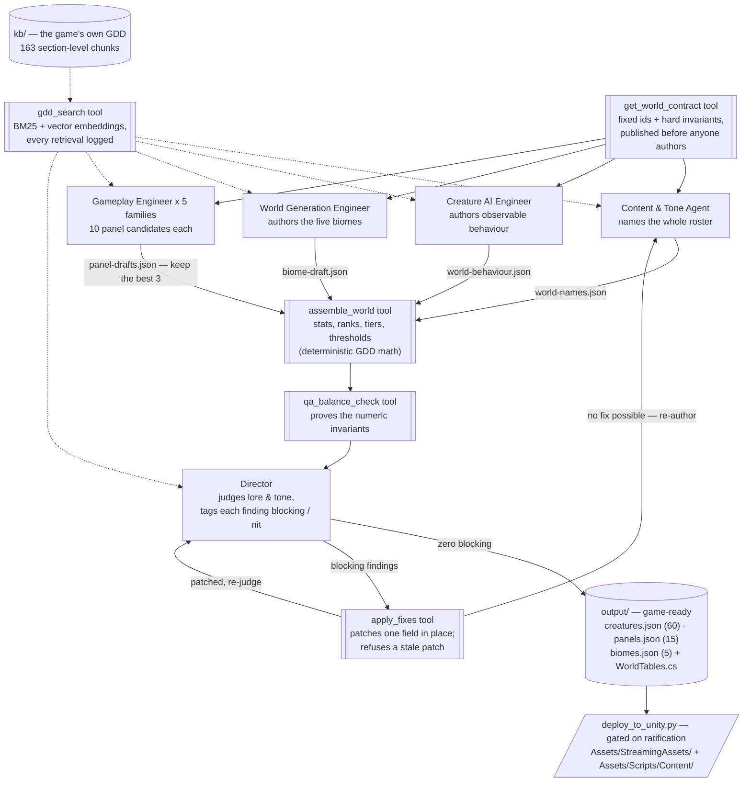
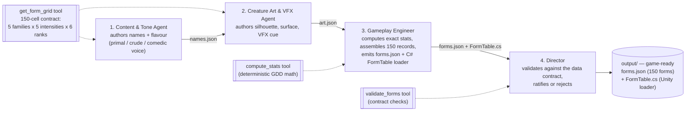

# Morphivore — AI Pipelines

Multi-agent pipelines that build **Morphivore**, my capstone game — a
cube-creature action roguelite where you eat creatures to mutate, evolve, and
take over an ecosystem.

| | Pipeline | Produces |
|---|---|---|
| **Assignment #3** | Bestiary Form-Authoring Crew — 4 agents, sequential | `forms.json` (the 150 player forms) + `FormTable.cs` |
| **Assignment #4** | Dynamic Content Pipeline — RAG + parallel fan-out + a two-stage critic | `creatures.json`, `panels.json`, `biomes.json` + `WorldTables.cs` |
| **Assignment #5** | Goal-Oriented Coding Agent — reads the GDD, scans the codebase, ranks the gaps, writes C# | the game's identity system (`ColourBuffer.cs` + 7 rewritten files) |
| **Assignment #6** | Emblem GER Pipeline — Generate → Evaluate → Refine, with a circuit breaker | `emblems.json` (25) — the last unwritten file in the §3.3 content contract |
| **Assignment #7** | Style Guide Agent — scores content 1–10 against the game's own voice and repairs it | four constraints, and two live defects fixed in the shipped game text |

**Each builds on the last.** `crew.py` and `tools.py` are untouched by #4;
`rag.py`, `world_contract.py`, `tools_world.py` and `crew_world.py` are
additive, and #4 reuses #3's stat maths, agent roster, and authored form names
as a voice reference. #5 reuses #4's `rag.py` unmodified — repointed at a
scoped corpus — and its first shipped feature is the code that finally *reads*
the `forms.json` #3 authored.

> **This repository is extracted from the full Morphivore Unity project.** The
> crew normally lives inside that project as `agent-crew/`, which is why
> `deploy_to_unity.py` writes into `Assets/StreamingAssets/` and
> `Assets/Scripts/Content/` one directory up. Cloned on its own, point
> `MORPHIVORE_UNITY_ROOT` at a checkout of the game.

---

# Assignment #7 — Style Guide Agent

**→ Full write-up: [`style-guide/README.md`](style-guide/README.md)**

Generator → Evaluator → Refiner, enforcing Morphivore's own voice. The Evaluator returns a
**SCORE (1–10) and a REASON**, never a pass/fail — because "fail" gives the Refiner nothing
to aim at, so it would re-roll the whole line and lose what already worked.

**Where it runs:** immediately after the Generator in the [Assignment #6 emblem
pipeline](ger-emblems/), scoring every generated name and flavour line before the rule
Evaluator checks it for power grants.

**Four constraints, none invented.** Two quoted from the GDD and verified present at run
time — §3.1's *"primal, crude, comedic … form names are the entire authorial voice"* and
§2.8's *"panels are the run's only power source"*. Two **measured** from the 235 flavour
lines already shipped: at most 24 words and 2 sentences, and **zero exclamation marks in
the whole corpus**.

**The fourth constraint exists because the agent argued me into it.** Gating
`creatures.json`, it flagged all 25 Alpha names as high-fantasy title cards and wanted
`Bonelord of the Shattered Crags` renamed `Gristle Knuckle`. It was right about the rule
and wrong about the scope — Alpha names follow a convention my guide never mentioned. After
adding C4, all 8 Alpha names passed **and both real vocabulary catches survived**: noise
gone, signal kept.

**Run over all three shipped corpora**, and the trend is the finding:

| Corpus | Author | Mean score |
|---|---|---|
| `emblems.json` (25) | #6, with a voice brief | **8.70** |
| `creatures.json` (60) | #4 crew, August | **7.63** |
| `forms.json` (150) | #3 crew, July | **6.64** |

The further content sits from the guide, the worse it scores — the agent detecting
authorial drift across the project's own history. It caught `"Twin-Horn **Boss**"` in a game
whose champions are Alphas, and `"a better **trigger**"` in nine records of a game with no
firearms.

Two emblem repairs were deployed. Nothing else: the forms run wanted 121 rewrites of the
game's largest text corpus on its reading of one adjective, and that is a designer's call.

---

# Assignment #6 — Emblem GER Pipeline

**→ Full write-up: [`ger-emblems/README.md`](ger-emblems/README.md)** · Pre-Build
Declaration: [`ger-emblems/PRE-BUILD-DECLARATION.txt`](ger-emblems/PRE-BUILD-DECLARATION.txt)

A Generate → Evaluate → Refine loop with a circuit breaker, writing **`emblems.json`** —
the one file in Morphivore's §3.3 content contract that had never been written, by hand
or by the #3 and #4 crews.

| | |
|---|---|
| **Generator** | [`generator.py`](ger-emblems/generator.py) — 25 emblems, one per Alpha |
| **Evaluator** | [`evaluator.py`](ger-emblems/evaluator.py) — deterministic checks, then a verifier agent |
| **Refiner** | [`refiner.py`](ger-emblems/refiner.py) — patches the named field, 3 passes |
| **Circuit Breaker** | [`circuit_breaker.py`](ger-emblems/circuit_breaker.py) — escalates with a problem statement |
| **Run evidence** | [clean run](ger-emblems/runs/20260830-180754/ger-log.md) · [adversarial](ger-emblems/runs/20260830-181449/ger-log.md) · [shipping run](ger-emblems/runs/20260830-181721/ger-log.md) |

**The rule is retrieved, not hardcoded.** `contract.py` reuses #4's `rag.py` to pull it
from the GDD at run time — GDD §2.5: *"a trophy off a defeated rival, granting no power
of its own (powers come from panels)"* — and every run logs the passages it enforced.

**Two layers, because one cannot do it.** Code owns structure: forbidden fields, stat
notation, the Alpha roster, the biome chain. The verifier owns meaning — *"Wearing it,
you feel faster"* passes every deterministic check and still breaks the rule.

**What it caught was not what I expected.** The first run was clean, 25 of 25: told the
rule, the generator never once tried to grant a power. What it surfaced instead was a
defect in my own Evaluator — ids came back as the Alpha's *name* where the brief
specifies its *family*, and my format check was a loose regex that accepted both. A check
that documents a convention it does not enforce is worse than no check. Tightened, it
caught all 25 on the re-run and the Refiner repaired them.

The adversarial probes prove the loop: every check fired, `rule.implies_power` three
times (verifier-only), and the breaker escalated a **regression at pass 1** rather than
burning all three passes on an unwinnable record.

It runs in the game — `[Content] loaded 60 creatures, 5 biomes, 150 forms, 25 emblems`.

---

# Assignment #5 — Goal-Oriented Coding Agent

**→ Full write-up: [`coding-agent/README.md`](coding-agent/README.md)**

An agent that reads Morphivore's design document, scans Morphivore's codebase,
finds where the code has drifted from the design, decides what to build first,
and builds it.

| | |
|---|---|
| **Agent source** | [`coding-agent/`](coding-agent/) — entry point [`goal_agent.py`](coding-agent/goal_agent.py) |
| **The blackboard** | [discovery run](coding-agent/runs/20260809-220054/blackboard.md) · [build run](coding-agent/runs/20260809-220821/blackboard.md) |
| **Prompts as issued** | [46 discovery](coding-agent/runs/20260809-220054/prompts) · [2 build](coding-agent/runs/20260809-220821/prompts) |
| **Code as generated** | [`generated/`](coding-agent/runs/20260809-220821/generated) — pre-review snapshot |
| **Game C#** | [`Assets/Scripts/`](Assets/Scripts/) — what it scanned and what it wrote, at the real project path |

```bash
cd coding-agent
python goal_agent.py --discover   # find and rank gaps, write no code
python goal_agent.py --build      # also implement the top-ranked chunk
```

**Five stages.** `gdd_reader` (design sections only) → `code_scanner`
(deterministic; types, literals, and a reference graph over the data files) →
`gap_detector` (PRESENT / PARTIAL / ABSENT / **CONTRADICTED** / **UNCONSUMED**)
→ `prioritizer` (`score = (1 + blocks) × severity ÷ effort`) → `builder` (a
four-tool loop over the repo).

**Discovery runs blind.** The game repo contains a hand-written gap analysis and
priority order for this exact codebase. Stages 1–4 never see it, so the agent's
ranking can be *checked against* the human one instead of echoing it. Blind, it
reconstructed that plan's next chunk at ranks 1, 2, 3 and 6 — and derived its
sequencing rule unprompted:

> Deleting `ClassProfile` to make room for the five families removes the only
> functioning stat multiplier in the game, and its replacement is spread across
> three lower-ranked items plus an unread asset. Ship them as one merge or not
> at all.

**It shipped a working feature, and the feature has been played.** Eight files,
one 19-turn run, compiled clean on the first attempt and entered Play mode with
no exceptions:

```
CompileScripts: 20.921ms
[Content] loaded 60 creatures, 5 biomes, 150 forms from StreamingAssets.
```

Then verified by hand, which is the gate no agent signs off:

> Played it and verified it works. The transformation system is visibly at
> play — I transform into the creature I eat, and their names show in the UI.

| Before eating | After eating |
|---|---|
|  |  |
| `RANK 1 \| THE BLANK` — white is the empty state, form zero | `RANK 1 \| PALE RED \| JITTERY TWITCH-HOPPER` |

The right frame is the proof. `forms.json` holds `red_pale_r1` — family Red,
intensity Pale, rank 1, *"Jittery Twitch-Hopper"* — authored by the Assignment
#3 crew in July and read by nothing until now. The buffer state on screen
resolves to exactly that record, so one frame shows the whole chain: **#3
authored it → it sat unread → #5's reference graph flagged it UNCONSUMED →
#5's agent wrote the loader → it's on screen.**

That second line is the point. `forms.json` — 150 forms authored by the
Assignment #3 crew — had been shipped and read by nothing. A twenty-line
deterministic reference graph found it, and the agent wrote the code that loads
it.

**The blackboard.** Every run writes `runs/<ts>/blackboard.md` live: every gap
with the arithmetic behind its score, all 47 prompts exactly as issued, and
generated code logged *before* it touches the project. Two full runs are
committed as evidence. `AGENT_STATE.md` carries BUILT / DECISIONS / NEXT /
FAILED between sessions in plain markdown.

**What the developer changed before accepting it:** nothing in the generated
C#. The defect found in review was in the agent — its build loop ran without
prompt caching, costing $17.19 against $3.09 for a properly-cached discovery
run. Details, and the honest limits of what is observable in play, are in
[`coding-agent/README.md`](coding-agent/README.md).

---

# Assignment #4 — Dynamic Content Pipeline

A RAG + multi-agent content pipeline for **Morphivore**, built **on top of** the
Assignment #3 form-authoring crew rather than replacing it. `crew.py` and
`tools.py` are untouched; this adds retrieval, parallel execution, and a critic
that sends work back.

---

### 1. What content, and what gap it fills

Morphivore is deliberately anti-lore — no dialogue, no narrator, no item text.
So the gap was never "missing story". **The GDD names its own content contract in
§3.3: five JSON files the game loads at runtime.** Assignment #3 filled one.

| File | Defines | Status |
|---|---|---|
| `forms.json` | the 150 player forms | ✅ Assignment #3 |
| **`creatures.json`** | the wild roster — grazers, prey, elites, trait minibosses, Alphas, the Apex | **this assignment** |
| **`panels.json`** | decorated panels — the run's only power source | **this assignment** |
| **`biomes.json`** | the five territories — palettes, pockets, populations, gate thresholds | **this assignment** |
| `emblems.json` | 5 emblems | still open |

The three gaps, stated plainly:

1. **`creatures.json`** — *I had 150 authored creatures the player can **become**, and zero authored creatures for the player to **eat**.* Without this file the spawner has nothing to spawn.
2. **`panels.json`** — *my run's only power source was four adjectives.* §2.8 promotes panels to the only reward on a short interval, then names four example powers and stops.
3. **`biomes.json`** — *five biomes named in prose and defined nowhere.*

These map onto the course's content-type list in the game's own grammar:
NPC backstories → the wild roster; item descriptions → panels; lore entries → biomes.

**Output:** 60 creatures, 15 panels, 5 biomes, plus `WorldTables.cs` — a typed
Unity loader, so the engine consumes the content rather than a human reading it.

---

### 2. RAG implementation

`rag.py` builds one **shared lore database** every agent reads through a single
tool, `gdd_search`.

- **Knowledge base:** `kb/GDD-Extended.md` (895 lines, the game's own GDD) plus a
  voice digest of Assignment #3's `forms.json`, so new content is retrieved
  against the established register and not just an abstract description of it.
- **Chunking:** on the GDD's own `###` headings → **163 chunks**, each carrying a
  citable section number.
- **Retrieval:** hybrid — BM25 (always available) fused with chromadb ONNX vector
  embeddings by reciprocal rank fusion. Ranks are fused rather than scores,
  because BM25 scores and cosine similarities are not on a comparable scale.
  If the embedding model is unreachable, retrieval degrades to BM25 instead of
  failing.
- **Audit trail:** every retrieval is appended to `output/retrieval-log.jsonl`.
  The live run logged **342 retrievals across 310 distinct queries.**

#### Query → retrieved chunk → output

**Query** (`Content & Tone Agent`, backends `bm25 + embeddings`)
> `grazers definition colour limbless`

**Top chunk** — `GDD-Extended §2.3 [2/6]`
> *"**Grazers are limbless, and they are white** — the same white as a bare limb
> and a newborn cube: the game's one universal negative: *nothing here to take*.
> … A form's **dash speed = its Speed stat × its family Dash multiplier**, so the
> slowest dash in the game belongs to the 1-limb Yellow Brawler: 12 × 0.8 =
> **9.6**. Grazer flee speed is pinned in `creatures.json` **below that**"*

**Output** — `creatures.json`
```json
{ "id": "grazer_wetlands", "name": "Bog-Blob", "role": "grazer",
  "family": null, "carries_colour": false, "base_hex": "#FFFFFF",
  "counts_toward_alpha_gate": false,
  "spawns": [{ "biome": "wetlands", "flee_speed": 8.8 }] }
```

Colourless, white, outside the Alpha gate, flee speed **8.8 < 9.6** — every
property traceable to the retrieved passage.

---

### 3. Consistency checking — two critics, one loop

Assignment #3's Director validated a *schema*. That cannot catch a lore break.
This pipeline splits the job:

- **QA & Balance — the arithmetic critic** (deterministic, no LLM). Re-derives
  each expected number from the GDD's own stat model, so a violation is *proved*.
  Checks grazer flee speed vs. the 9.6 floor, prey/elite/alpha rank rules, that
  Alphas cannot be outrun, that Clash never wanders, panel sourcing and no-stack,
  worst-roll slack, palette breadth, population supply, and referential integrity.
- **Director — the fiction critic** (Claude Opus 5 + `gdd_search`). Judges the
  authored prose: invented families, meat that may not wander, emblems granting
  power, traits on limbs, invented lore, tone drift.

Both must return `{"status": "pass"}` before anything is ratified. A failure
feeds a bounded repair round, and **every rejected draft plus its verdict is
archived** to `output/critic-log/`.

#### What the Director caught — and the corrections that landed

On the first live judging pass QA **passed** and the Director **rejected with 8
findings**. Three of them, with the corrections that were then applied verbatim:

| Break | Before | After |
|---|---|---|
| **Circular trait gate.** The Heat carrier was placed inside the lava its own trait unlocks — the exact failure §3.3 invariant 1 forbids. | *"Rises out of the shimmer near a vent as the player closes in, **with no cool ground left on either side to retreat to**."* | *"Rises out of the shimmer as the player closes in **from the cool sand, the vent at its own back**."* |
| **Name collision.** The Grey elite took a title already used by the whole Yellow Alpha line, breaking colour-as-grammar. | `elite_grey` = **"The Warlord"** (vs. *Warlord of the Open Plains / Drowned Marsh / …*) | `elite_grey` = **"The Iron-Hide"** |
| **Borrowed genre furniture.** §2.5 states flatly *"You are not summoned to a boss room — you are found."* | *"Bounces off every **wall in the arena** before you feel the first hit."* | *"Bounces off every **rock in the hollow** before you feel the first hit."* |

Four further findings caught panels mounted on the **main cubic face** — real
estate §2.6a reserves for traits (`"brow ridge"`, `"temple"`, `"cheek"`), and one
caught an invented tier: *"apex-tier"*, when Apex is Grey's **class** and the
ladder is Pale/Dusk/Deep/Rage plus Clash.

**The most instructive result:** the circular trait gate **passed the arithmetic
critic and failed the fiction critic.** My deterministic check verified the
carrier's *biome membership* and found nothing wrong; the break lived in the
authored prose. That is the argument for having both.

#### The severity threshold — and why it was necessary

The first design demanded a *spotless* verdict. Across three live judging passes
the Director returned 8, 8 and 9 findings — never converging, because a fresh
pass over 80 records always surfaces something. Chasing zero findings does not
terminate.

So the verdict schema now carries a severity, and the ratification bar changed
from "no findings" to **"no blocking findings"**:

- **blocking** — the content *contradicts a stated GDD rule*: an invented family
  or tier, meat that may not wander, an emblem granting power, a trait or panel
  on the wrong real estate, a carrier behind its own gate, invented lore.
- **nit** — a preference, not a contradiction: wording to tighten, a flat line,
  mild repetition. Nits are **recorded and shipped** as advisories.

The effect was immediate and is the clearest evidence the threshold was the right
call. The same critic, on the same content, went from *"8 findings, all fatal"* to:

> **1 blocking, 22 nits**

Twenty-two of those twenty-three findings were always style preferences; the old
schema just had no way to say so.

#### A second finding: repair by re-authoring regresses — so the loop patches instead

The first repair design re-authored an entire track from scratch with the
findings appended. On a large corpus that is a lossy operation: to fix one bad
line in `panels.json`, the agent regenerates all fifteen panels — the bad line
gets fixed, and some of the other fourteen come back different. We watched it
happen:

| Round | Blocking | Nits |
|---|---|---|
| 0 | **1** | 22 |
| 1 (after re-authoring) | **7** | 16 |

It went *backwards*. The clearest symptom: the repair took the Director's
replacement text for `panel_red_vigour` (a **panel**) and pasted it onto
`elite_yellow` (a **creature**). Re-authoring lost track of which fix belonged
where.

**So the repair mechanism was rebuilt.** The Director no longer just describes a
correction in prose — it emits a structured patch alongside every blocking
finding:

```json
{"severity": "blocking", "id": "panel_red_vigour",
 "detail": "written as an activated one-shot heal, which contradicts §2.3 ...",
 "fix": {"file": "panels", "path": "flavor",
         "old": "Squeeze it before you go down. Tastes like copper and a bad decision.",
         "new": "Ripped off something that would not lie down. Bolted on, it keeps
                 you upright a beat longer than you deserve."}}
```

`tools_world.apply_fixes()` applies that verbatim — one object, one field,
nothing else touched. Three properties make it safe:

- **A stale patch is refused, not forced.** If `old` doesn't match what is on
  disk, the fix is skipped with *"refusing to guess"* — a mismatch means the
  critic was describing different content, and applying it anyway would corrupt
  the file.
- **`path` may be dotted** (`behaviour.opening`), so nested fields are reachable.
- **Re-authoring is the fallback, not the default.** Only findings with no
  applicable fix — the record is structurally wrong, or the same error spans many
  records — send a track back to be rewritten.

#### What running it end-to-end found

Rebuilding the mechanism is one thing; exercising it against a live critic is
another. Running it repeatedly found **three mechanism bugs and two content-contract
bugs**, and ended in a genuine clean pass:

```
OK: recorded pass -- 0 blocking (0 with an applicable fix), 16 nit(s)
```

**Mechanism bugs**

1. **Paths could not index into lists.** A fix targeted `pockets.0` — biomes carry
   a `pockets` array — and the dict-only walker refused it with *"path not
   present"*, sending an entire track back for re-authoring over one line. `_dig`
   now treats a numeric segment as a list index; out-of-range is still refused.

2. **Re-assembly silently discarded applied patches.** `assemble_world` rebuilds
   **all three** files from the drafts, so when one unpatchable finding forced a
   track to be re-authored, the rebuild wiped the patches already applied to the
   *other* files. The run proved it: `elite_yellow` came back with neither its
   original nor its patched text — nine good fixes lost.
   Fixed with a **patch ledger**: every applied patch is recorded durably and
   replayed after any assembly onto files that were not re-authored (entries for
   regenerated tracks are dropped as moot). Because an un-re-authored track
   rebuilds from the same drafts, its pre-patch text returns exactly, so each
   entry's `old` still matches and the replay is safe rather than forced. Later
   verified live: **5 patches survived a rebuild that previously destroyed them.**

3. **The critic namespaced its ids.** It wrote `"biomes/prairies"` where the
   record's id is `prairies`, so *every* otherwise-valid patch was refused and the
   pipeline fell back to re-authoring everything. Fixed on both sides — the prompt
   now pins the format, and the lookup tolerates a `<file>/` prefix. Robustness
   belongs on the consuming side when the producer is an LLM.

**Content-contract bugs — mine, not the agents'**

4. **I invented two panel powers.** `PANEL_POWERS` carried `bite` and `vigour`
   alongside the GDD's four. §2.8 names exactly four — lock range, dash, guard,
   camouflage — and Damage and Health come from family and intensity (§2.4), not
   from a bolt-on. The agents authored faithfully into the slots they were given;
   the Director then rejected the results across several rounds, correctly and
   repeatedly, until the contract was fixed. A recurring critic finding is worth
   reading as a bug report about the contract, not noise.

5. **The Apex borrowed the Grey Alpha's behaviour.** Assembly handed the rank-6
   Apex the same behaviour block as the Grey Alphas, so it inherited biome-Alpha
   machinery — two gates, "hunts you across the biome" — when it should lie dormant
   in the Ascension until the Bestiary crosses 100/150. The Apex now has its own
   required behaviour block.

#### Moving checks from the LLM critic to the arithmetic one — and where that stops

Two findings recurred across runs and are pure literal matching, so they moved into
the deterministic critic where they cost nothing: **panels mounted on main-face
real estate** (trait territory, §2.6a) and **duplicate panel names**.

A third was tried and **removed**: whether a trait carrier's prose places the fight
inside the terrain its own trait unlocks. The keyword version flagged

> *"holding the reedy shallows and mud banks at its edge **rather than the open water**"*

as a circular gate — the offending phrase is present and the negation is invisible
to a substring match. That is the dividing line between the two critics: `attach` is
a short noun phrase and suits keyword matching, while behaviour is prose where
*"X rather than Y"* is exactly how a corrected line reads. A deterministic check that
cries wolf is worse than none.

The break this was demonstrated on is a good one to end on: the panel had been
written as an *activated one-shot heal*, which contradicts three rules at once —
§2.3 (only grazers refill Health), §2.1 (there is no use-item input in the game)
and §2.8 (panels are standing powers, not consumables).

---

### 4. Voice judgment — do these sound like my game?

The exercise: one high-stakes prompt, one ambient prompt, both against the KB.

**High stakes — the Alpha that answers you**
> **Ravager of the Molten Scar** — *"Good at every part of killing you, which is the whole problem."*
> Tell: *"Holds its ground and squares up through a long wind-up before driving in — and it keeps closing the whole time it holds the lock."*

**Ambient — the background meat**
> **Bog-Blob** — *"Wallows in the shallows, soft and blind and no trouble at all."*

**Assessment: yes, with one caveat.** Both sit in the same primal/crude/comedic
register as the 150 form names from #3 — *Runty Gutbag*, *Rabid Springfang*,
*"Eats pain for breakfast and asks for seconds."* Nothing reads as generic
fantasy; the Alpha's flavour is a joke about competence rather than a boast, and
the grazer's is dismissive in exactly the way a creature that "carries nothing
you can become" should be. The Alpha's *tell* is mechanically precise because it
was written from retrieved §2.2/§2.5 text, not invented.

The caveat is itself evidence the critic works: the Director flagged the grazer
idle line *"Grazes calmly **on all fours**"* — grazers are **limbless**, so they
have no fours. That correction was queued when the run stopped (see §6).

#### The retrieval tweak that improved game-fit

The first chunking used a 40-word window overlap. A test query for grazer
behaviour returned §2.3 chunks `[2/5]` and `[4/5]` — and the flee-speed
derivation was split across the boundary, so retrieval returned **the rule
without its number**:

> *"…A form's **dash speed = its Speed"*  ← cut off mid-sentence

The pipeline would have authored grazers blind to the 9.6 floor that governs
them. **Raising the overlap to 90 words** made the whole derivation survive
windowing intact, and the same query now returns `12 × 0.8 = 9.6. Grazer flee
speed is pinned below that` in one piece. A hard invariant has to survive
chunking to be retrievable.

---

### 5. Parallel execution

The grader's note on Assignment #3 was to add parallelism on top of the
sequential crew. Here it is structural, on two axes:



The four authoring nodes are **8 concurrent crews** — the panel node is five of
them, one per elite family. **Measured: 336 s wall clock.**

Parallelism is *justified*, not decorative. `biomes.json` names Alpha rosters and
`panels.json` names the elites that drop each panel — so if IDs were invented by
whichever agent got there first, the tracks would be forced into a chain.
`get_world_contract` publishes the ID namespace up front (the same trick
`get_form_grid` used for the 150 cells), which removes the dependency.

The second axis is the generate-N-keep-3 pattern: each elite family produces ten
candidate panels concurrently, and a deterministic selection keeps three,
enforcing power variety and the no-stack rule.

#### Three real bugs this surfaced

1. **`RuntimeError: Executor is already running`** — all five panel crews shared
   one `Agent` object. A CrewAI Agent owns a stateful executor, so concurrent
   crews need their own instances. Agents are now factories, not singletons.
2. **`Agent execution was invoked synchronously from within a running event
   loop`** — the Director was called with `kickoff()` inside `async def main()`.
   Now `await kickoff_async()`.
3. **`Invalid response from LLM call - None or empty`** — on Claude Opus 5 and
   Sonnet 5, adaptive thinking is **on by default** and `max_tokens` caps
   thinking *plus* response text together. The Director reads 80 records before
   ruling; at 8192 it spent the whole budget reasoning and returned nothing.
   Critics now get 32000, authors 24000.

---

### 6. The engine consumes it

`deploy_to_unity.py` is gated on ratification — it **refuses** to place content
whose `lore_verified` is false, so an unreviewed draft can never reach the game.
That gate was observed doing its job before ratification:

```
Blocked:
- creatures.json: lore_verified is false -- the critics have not ratified it
```

After ratification, the same command placed all four content files and both
loaders, and the Unity MCP bridge refreshed and compiled them clean:

```
Assets/StreamingAssets/creatures.json      Assets/Scripts/Content/WorldTables.cs
Assets/StreamingAssets/panels.json         Assets/Scripts/Content/FormTable.cs
Assets/StreamingAssets/biomes.json
Assets/StreamingAssets/forms.json
```

`unity_refresh_assets` → *"Asset database refreshed"*; `Editor.log` grep for
`error CS` → **0**; `unity_list_scripts` confirms both loaders are in the project.

This also closes a gap left by Assignment #3: that crew emitted `forms.json` and
`FormTable.cs` and *described* where they would go, but nothing was ever placed.
They ship here alongside the new files.

### 7. Honest status

- ✅ Every stage built and run live: RAG, world contract, 8-way parallel
  authoring, deterministic assembly, both critics, the severity threshold, the
  patch-in-place repair loop, the deploy gate, and the Unity compile check.
- ✅ **Content is ratified by a genuine clean judging pass** — QA & Balance PASS,
  Director PASS with **0 blocking** and 16 nits shipped as advisories. Not a
  manual override: the critic was asked and said yes.
- 📌 **Provenance.** Reaching that pass took several judging rounds and five bug
  fixes (three in the repair mechanism, two in the content contract). Because
  each Director pass is expensive, individual tracks were re-authored and
  re-judged in targeted steps rather than by repeatedly re-running the whole
  pipeline from cold. Every step used the pipeline's own code paths — the same
  `apply_fixes`, `assemble_world`, `replay_patches` and Director crew — but the
  run was **resumed rather than continuous**, and that is worth stating plainly.
- ⚠️ **The generated content is not yet spawned by the game.** `WorldTables.cs`
  compiles and the JSON sits in `StreamingAssets/`, but `EcosystemManager` still
  spawns from the hardcoded tables in `GameConfig`. The honest claim is *the
  engine ingests and compiles this content*, not *the game runs on it*. Wiring
  the spawner to `creatures.json` is the next piece of work.
- 📝 Two findings worth carrying forward, both now fixed in the pipeline: an LLM
  critic on a large corpus never converges to zero findings, so ship on a
  severity threshold; and repair by re-authoring regresses content, so the critic
  emits a structured patch that is applied in place.

---

### 8. How to run it

```bash
cd agent-crew
python3.12 -m venv .venv
.venv/bin/python -m pip install -r requirements.txt
cp .env.example .env          # then add ANTHROPIC_API_KEY
```

Inspect the knowledge base without spending a token — this also prints the chunk
count and which retrieval backends are live:

```bash
.venv/bin/python rag.py "how fast do grazers flee and what colour are they"
```

Run the full pipeline (8 concurrent crews, then both critics, then up to two
repair rounds):

```bash
.venv/bin/python crew_world.py
```

Re-judge content that is already authored, without re-paying for the fan-out:

```bash
.venv/bin/python crew_world.py --from-drafts
```

Re-author only the creature track against the recorded findings:

```bash
.venv/bin/python repair_creatures.py
```

Recover an interrupted run: re-open the archived draft with the fewest blocking
findings, apply that round's recorded fixes to it with the same `apply_fixes`
the loop uses, re-check, and ratify:

```bash
.venv/bin/python finalize.py --dry-run
```

```bash
.venv/bin/python finalize.py
```

Check whether content is ratified, then place it in the Unity project:

```bash
.venv/bin/python deploy_to_unity.py --check
```

```bash
.venv/bin/python deploy_to_unity.py
```

Model split is env-overridable:

```bash
MORPHIVORE_CRITIC_MODEL=anthropic/claude-opus-5 MORPHIVORE_AUTHOR_MODEL=anthropic/claude-sonnet-5 .venv/bin/python crew_world.py
```

#### Where the evidence lives

| Path | What it proves |
|---|---|
| `output/critic-log/accepted/` | **start here** — the ratified content, the verdict the patches came from, every field changed, and the arithmetic re-check |
| `output/critic-log/round-*-rejected/` | earlier drafts that did not make it, kept with the verdicts that rejected them |
| `output/critic-log/patches-applied.json` | each fix: id, field, old text, new text |
| `output/critic-log/qa-verdict.json` | the arithmetic critic's proof list |
| `output/retrieval-log-sample.jsonl` | query, backend, chunks and scores — the RAG audit trail (full log gitignored, 2.9 MB) |
| `output/creatures.json`, `panels.json`, `biomes.json` | the generated content, `lore_verified: true` |
| `output/WorldTables.cs` | the typed Unity loader |

Note on reading the log: the top-level `director-verdict.json` is the **most
recent** verdict, which on a patched run is the pre-patch FAIL. That is not a
contradiction — it is the input the patches were derived from. The post-patch
state lives in `accepted/`.

---

# Assignment #3 — Bestiary Form-Authoring Crew

A CrewAI multi-agent crew that authors **the 150 Bestiary forms** for **Morphivore**,
my capstone game — a cube-creature game where you eat same-or-lower-tier enemies
to mutate, evolve, and dominate an ecosystem.

### What game is this for?

**Morphivore** (working codebase name "Cubic Evolution"). Its core identity is a
form space of exactly **150 creatures = 5 colour families × 5 intensity tiers × 6
ranks**, each family a playstyle (Yellow Brawler, Red Leaper, Blue Sniper, Purple
Stalker, Grey Apex). The game loads these forms from a data file at runtime
(`forms.json`, per GDD §3.3 "content data is JSON, not code").

### What does the crew produce?

Two game-ready files in `output/`:

**1. `forms.json`** — the 150 fully-populated form records the game loads directly
(schema-checked on load). Each record carries: family, playstyle class, intensity
(+ its %), rank, an authored **name** and **flavour** line, the **socket layout**
(which of a cube's six faces hold limbs — the authored silhouette), base colour +
saturation, surface look, feedback **VFX** cue, and an exact **stat block**
(health, damage, speed, reach, dash).

**2. `FormTable.cs`** — the Unity C# loader that ships alongside the data. It
defines the `FormDef` / `StatBlock` structs mirroring the JSON schema and a
`FormTable.Load(json)` method that parses `forms.json` into a typed `FormDef[]`, so
the game consumes authored content type-safely instead of hand-parsing JSON.

### How it plugs into Morphivore

The crew is Morphivore's **content pipeline**, run at development time: it bakes
its work into a static JSON file the game reads offline, so the game stays
latency-free and reproducible.

**Load path.** `output/forms.json` is placed in the Unity project under
`Assets/StreamingAssets/forms.json`, and `output/FormTable.cs` goes in
`Assets/Scripts/`. At boot the game reads the file and calls `FormTable.Load(json)`,
turning it into a typed `FormDef[]` — schema-checked, with a fallback to built-in
defaults if the file is missing or malformed (GDD §3.3).

**Where each field is used in-game:**

| Form field | Game system it drives |
|---|---|
| `family` + `intensity` + `rank` | The mutation/evolution resolver — a creature's colour buffer resolves to **exactly one** of these 150 forms (GDD §2.4a/b) |
| `stats` (health, damage, speed, reach, dash) | Per-creature instantiation; feeds the combat loop (lock-on → pounce → knock down → eat) and stat recompute on evolve |
| `socket_layout` | Procedural morphology in `Creature.BuildVisuals()` — which of the cube's six faces grow limbs |
| `base_hex` + `saturation` + `surface` | Creature rendering (colour = playstyle class, saturation = intensity tier) |
| `vfx` | The two "absorb languages" — colour streaming into a limb (prey) vs. a body-dissolve cue (grazers) |
| `name` + `flavor` | The **Bestiary** meta screen — the fossil record of every form the player has taken |

**Status.** The playable prototype currently builds creatures procedurally from
code-side tables; `forms.json` becomes the authored source of truth as the
colour-buffer / mutation system (the next milestone on the combat-loop roadmap) is
wired to resolve buffer states to these 150 forms. Re-running the crew re-authors
the entire Bestiary without touching game code — content and code stay decoupled.

### The crew (4 agents, sequential)

Each agent maps 1:1 onto a role defined in the game's own GDD (§3.1 Agent
Interfaces). The pipeline is strictly ordered and **no agent can be removed
without breaking it**:



| # | Agent | Input | Output | Why it can't be removed |
|---|-------|-------|--------|-------------------------|
| 1 | **Content & Tone** | The 150-cell grid + tone brief | Naming scheme: per-family rank ladders + per-strain `{name, flavor}` → `names.json` | Names are the game's *entire* authorial voice; nothing downstream has an identity without it. |
| 2 | **Creature Art & VFX** | The grid | Art scheme: per-family silhouette + per-strain `{surface, vfx}` → `art.json` | The game can't render a form with no silhouette/surface/VFX. |
| 3 | **Gameplay Engineer** | `names.json` + `art.json` | The full 150-record `forms.json` + `FormTable.cs`, stats computed via a deterministic tool | The game can't instantiate a playable/enemy form with no stat block. |
| 4 | **Director** | `forms.json` | PASS/FAIL ratification report | Without it, a malformed/incomplete file breaks the game's schema-checked loader. |

#### Design note — reliability & honesty

The LLM agents author at the **25-identity level** (5 families × 5 intensities)
plus per-family rank ladders — bounded, cheap outputs. Deterministic **tools**
then (a) supply the authoritative 150-cell grid, (b) compute every stat block
exactly from the GDD's intensity-scaling rule (`stat = rank_baseline × [1 +
(family_mult − 1) × intensity_fraction]`), (c) expand to 150 unique records, and
(d) validate the result. The LLMs never do arithmetic and never shuttle 150
records between each other — which is what keeps the run fast, cheap, and
crash-free.

### Repository layout

| File | What it does |
|---|---|
| `crew.py` | **Entry point.** Defines the 4 agents and 4 tasks, wires them into a sequential CrewAI pipeline, configures the Claude LLM, and runs the crew (`python crew.py`). |
| `tools.py` | **The deterministic engine.** Holds the data contract (families, intensity tiers, ranks, GDD stat tables) and the 5 custom tools the agents call — `get_form_grid`, `save_naming_scheme`, `save_art_scheme`, `assemble_forms`, `validate_forms`. No LLM logic here; it's pure Python, so all maths and validation are exact and reproducible. |
| `requirements.txt` | Python dependencies (`crewai`, `python-dotenv`). |
| `.env.example` | Template for your `ANTHROPIC_API_KEY` (+ optional model override). Copy to `.env`. |
| `output/forms.json` | Sample output from a real run — the 150 authored forms. |
| `output/FormTable.cs` | Sample output — the generated Unity C# loader. |

**How the two code files interact.** `crew.py` imports the tools from `tools.py`
and hands each agent only the tools its job needs:

| Agent | Tools it holds |
|---|---|
| Content & Tone | `get_form_grid`, `save_naming_scheme` |
| Creature Art & VFX | `get_form_grid`, `save_art_scheme` |
| Gameplay Engineer | `assemble_forms` |
| Director | `validate_forms` |

The agents don't pass 150 records to each other directly — each writes its layer
to a file in `output/` (`names.json`, then `art.json`); the Gameplay Engineer's
`assemble_forms` reads both, computes stats, and writes `forms.json` +
`FormTable.cs`; the Director's `validate_forms` reads `forms.json` and ratifies it.
That disk hand-off is what keeps the run cheap and crash-free.

### Prerequisites

- **Python 3.10 or newer.** Check with `python3 --version` (macOS/Linux) or
  `python --version` (Windows).
  - **macOS** (Homebrew): `brew install python@3.12`
  - **Windows**: install from [python.org](https://www.python.org/downloads/)
    (tick *"Add Python to PATH"* in the installer) or `winget install Python.Python.3.12`
- **An Anthropic API key with credits** — create one at
  [console.anthropic.com](https://console.anthropic.com) (Billing → add a few
  dollars of credits, then API Keys → Create Key). This is the pay-as-you-go
  developer API, separate from any Claude.ai / Claude subscription.

### Run it

From the repository root:

**macOS / Linux:**

```bash
python3 -m venv .venv && source .venv/bin/activate
pip install -r requirements.txt
cp .env.example .env          # then add your ANTHROPIC_API_KEY
python crew.py
```

**Windows (PowerShell):**

```powershell
python -m venv .venv; .venv\Scripts\Activate.ps1
pip install -r requirements.txt
copy .env.example .env        # then add your ANTHROPIC_API_KEY
python crew.py
```

Output lands in `output/`:
- `forms.json` — the 150 authored forms (the deliverable the game loads)
- `FormTable.cs` — the Unity C# loader
- `names.json`, `art.json` — the intermediate authored schemes (handoff artifacts)

Model defaults to `anthropic/claude-opus-5`; override via `MORPHIVORE_CREW_MODEL`
in `.env` (e.g. `anthropic/claude-sonnet-5` for cheaper iteration).

### Tech

- **CrewAI** for agent orchestration (sequential process), routing to **Claude**
  via LiteLLM.
- Custom deterministic tools (`tools.py`) for the grid, stat math, assembly, the
  C# loader, and contract validation.
