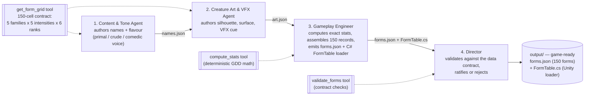

# Morphivore — Bestiary Form-Authoring Crew

A CrewAI multi-agent crew that authors **the 150 Bestiary forms** for **Morphivore**,
my capstone game — a cube-creature game where you eat same-or-lower-tier enemies
to mutate, evolve, and dominate an ecosystem.

## What game is this for?

**Morphivore** (working codebase name "Cubic Evolution"). Its core identity is a
form space of exactly **150 creatures = 5 colour families × 5 intensity tiers × 6
ranks**, each family a playstyle (Yellow Brawler, Red Leaper, Blue Sniper, Purple
Stalker, Grey Apex). The game loads these forms from a data file at runtime
(`forms.json`, per GDD §3.3 "content data is JSON, not code").

## What does the crew produce?

Two game-ready files in `output/`:

**1. `forms.json`** — the 150 fully-populated form records the game loads directly
(schema-checked on load). Each record carries: family, playstyle class, intensity
(+ its %), rank, an authored **name** and **flavour** line, the **socket layout**
(which of a cube's six faces hold limbs — the authored silhouette), base colour +
saturation, surface look, feedback **VFX** cue, and an exact **stat block**
(health, damage, speed, reach, dash).

**2. `FormTable.cs`** — the Unity C# loader that ships alongside the data. It
defines the `FormDef` / `StatBlock` structs mirroring the JSON schema and a
`FormTable.Load(json)` method that parses `forms.json` into a typed `FormDef[]`, so
the game consumes authored content type-safely instead of hand-parsing JSON.

## How it plugs into Morphivore

The crew is Morphivore's **content pipeline**, run at development time — not
something that runs inside the shipped game. This matches the game's architecture
(GDD §3): the multi-agent system is *"the development studio, not the product."*
Nothing in the finished game calls a language model while you play; the crew bakes
its work into a static JSON file the game reads offline, so the game stays
latency-free and reproducible.

**Load path.** `output/forms.json` is placed in the Unity project under
`Assets/StreamingAssets/forms.json`, and `output/FormTable.cs` goes in
`Assets/Scripts/`. At boot the game reads the file and calls `FormTable.Load(json)`,
turning it into a typed `FormDef[]` — schema-checked, with a fallback to built-in
defaults if the file is missing or malformed (GDD §3.3).

**Where each field is used in-game:**

| Form field | Game system it drives |
|---|---|
| `family` + `intensity` + `rank` | The mutation/evolution resolver — a creature's colour buffer resolves to **exactly one** of these 150 forms (GDD §2.4a/b) |
| `stats` (health, damage, speed, reach, dash) | Per-creature instantiation; feeds the combat loop (lock-on → pounce → knock down → eat) and stat recompute on evolve |
| `socket_layout` | Procedural morphology in `Creature.BuildVisuals()` — which of the cube's six faces grow limbs |
| `base_hex` + `saturation` + `surface` | Creature rendering (colour = playstyle class, saturation = intensity tier) |
| `vfx` | The two "absorb languages" — colour streaming into a limb (prey) vs. a body-dissolve cue (grazers) |
| `name` + `flavor` | The **Bestiary** meta screen — the fossil record of every form the player has taken |

**Status.** The playable prototype currently builds creatures procedurally from
code-side tables; `forms.json` becomes the authored source of truth as the
colour-buffer / mutation system (the next milestone on the combat-loop roadmap) is
wired to resolve buffer states to these 150 forms. Re-running the crew re-authors
the entire Bestiary without touching game code — content and code stay decoupled.

## The crew (4 agents, sequential)

Each agent maps 1:1 onto a role defined in the game's own GDD (§3.1 Agent
Interfaces). The pipeline is strictly ordered and **no agent can be removed
without breaking it**:



| # | Agent | Input | Output | Why it can't be removed |
|---|-------|-------|--------|-------------------------|
| 1 | **Content & Tone** | The 150-cell grid + tone brief | Naming scheme: per-family rank ladders + per-strain `{name, flavor}` → `names.json` | Names are the game's *entire* authorial voice; nothing downstream has an identity without it. |
| 2 | **Creature Art & VFX** | The grid | Art scheme: per-family silhouette + per-strain `{surface, vfx}` → `art.json` | The game can't render a form with no silhouette/surface/VFX. |
| 3 | **Gameplay Engineer** | `names.json` + `art.json` | The full 150-record `forms.json` + `FormTable.cs`, stats computed via a deterministic tool | The game can't instantiate a playable/enemy form with no stat block. |
| 4 | **Director** | `forms.json` | PASS/FAIL ratification report | Without it, a malformed/incomplete file breaks the game's schema-checked loader. |

### Design note — reliability & honesty

The LLM agents author at the **25-identity level** (5 families × 5 intensities)
plus per-family rank ladders — bounded, cheap outputs. Deterministic **tools**
then (a) supply the authoritative 150-cell grid, (b) compute every stat block
exactly from the GDD's intensity-scaling rule (`stat = rank_baseline × [1 +
(family_mult − 1) × intensity_fraction]`), (c) expand to 150 unique records, and
(d) validate the result. The LLMs never do arithmetic and never shuttle 150
records between each other — which is what keeps the run fast, cheap, and
crash-free.

## Run it

```bash
cd agent-crew
python -m venv .venv && source .venv/bin/activate
pip install -r requirements.txt
cp .env.example .env          # then add your ANTHROPIC_API_KEY
python crew.py
```

Output lands in `agent-crew/output/`:
- `forms.json` — the 150 authored forms (the deliverable the game loads)
- `FormTable.cs` — the Unity C# loader
- `names.json`, `art.json` — the intermediate authored schemes (handoff artifacts)

Model defaults to `anthropic/claude-opus-5`; override via `MORPHIVORE_CREW_MODEL`
in `.env` (e.g. `anthropic/claude-sonnet-5` for cheaper iteration).

## Tech

- **CrewAI** for agent orchestration (sequential process), routing to **Claude**
  via LiteLLM.
- Custom deterministic tools (`tools.py`) for the grid, stat math, assembly, the
  C# loader, and contract validation.
