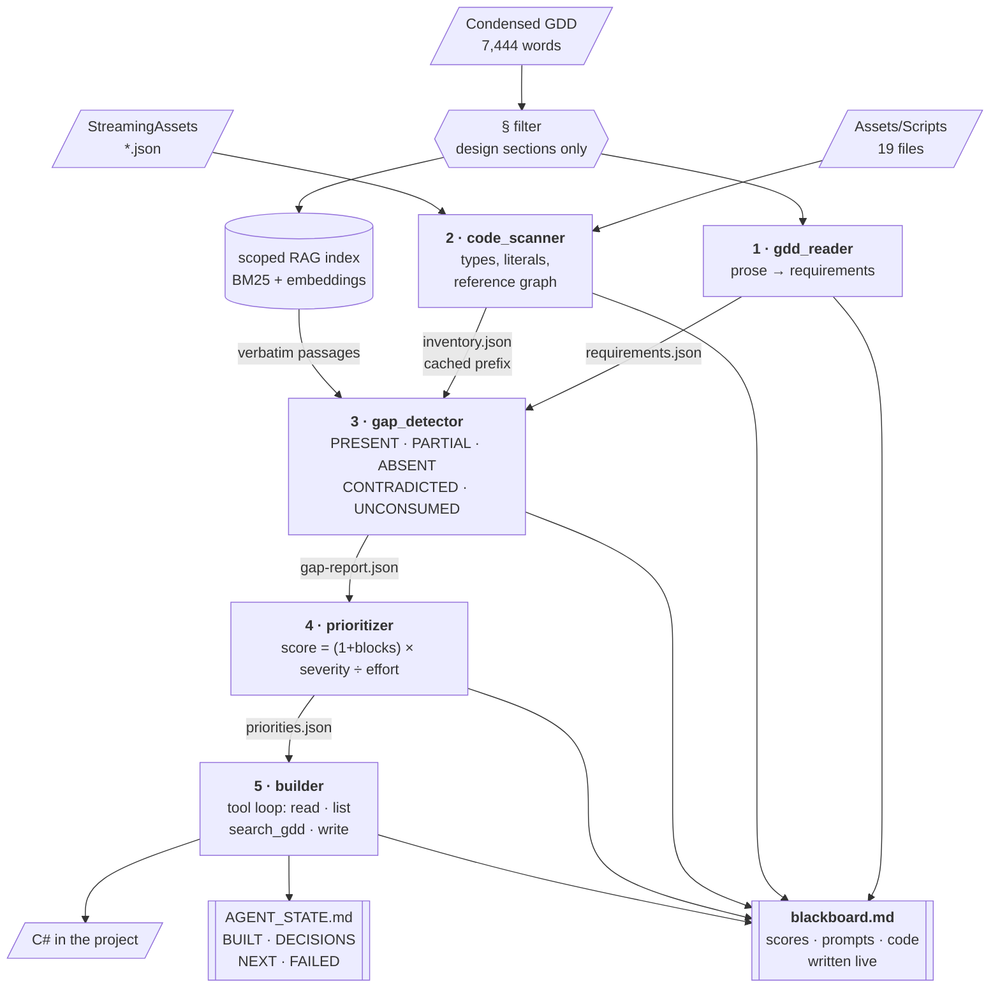

# Morphivore — Goal-Oriented Coding Agent

**Assignment #5.** An agent that reads the game's design document, scans the game's
codebase, works out what the design asks for that the code does not do, decides what to
build first, and builds it.

The game is **Morphivore**, the capstone: a creature-eating game where identity is the
colours you have eaten. It already exists — 19 C# files, ~4,000 lines, a procedural
world, and four JSON content files authored by the Assignment #3 and #4 crews. That
matters here, because this agent's job is not to scaffold a new project. It is to find
where a real, half-built codebase has drifted from its own design.

```bash
cd agent-crew/coding-agent
python goal_agent.py --discover     # stages 1-4: find and rank gaps, write no code
python goal_agent.py --build        # stages 1-5: also implement the top chunk
```

---

## The five stages



### The code

| Stage | Module | Model? | Output |
|---|---|---|---|
| 1 | **[`gdd_reader.py`](gdd_reader.py)** | yes | [`requirements.json`](runs/20260809-220054/requirements.json) — 45 checkable requirements |
| 2 | **[`code_scanner.py`](code_scanner.py)** | **no** | [`inventory.json`](runs/20260809-220054/inventory.json) — types, members, literals, reference graph |
| 3 | **[`gap_detector.py`](gap_detector.py)** | yes, 1/requirement | [`gap-report.json`](runs/20260809-220054/gap-report.json) — a verdict with cited evidence |
| 4 | **[`prioritizer.py`](prioritizer.py)** | arithmetic + 1 call | [`priorities.json`](runs/20260809-220054/priorities.json) — ranked, with the reasoning |
| 5 | **[`builder.py`](builder.py)** | tool loop | C# written into `Assets/Scripts/` |

Supporting: **[`goal_agent.py`](goal_agent.py)** is the CLI that runs the five in order —
start here. **[`blackboard.py`](blackboard.py)** is the live decision record,
**[`gdd_rag.py`](gdd_rag.py)** the scoped retrieval layer, **[`common.py`](common.py)**
paths, the model client and cost accounting.

---

## The blackboard

Every run writes `runs/<timestamp>/blackboard.md` **as it happens**, and it answers the
three questions you need answered when something else is writing code in your project.

**What it scored.** Every gap, its utility score, and each term that produced it —
blocking degree, severity weight, effort. If you disagree with the order you can point at
the term you disagree with.

**What it issued.** `runs/<timestamp>/prompts/` holds the full text of all 47 prompts,
system and user, exactly as sent. Not a summary of what the agent was asked — what it was
asked.

**What it generated.** Every file, logged *before* it touches the repo, plus a verbatim
snapshot in `runs/<timestamp>/generated/`. That snapshot is what makes the "what I
changed before accepting it" section below a diff rather than a memory.

Alongside it, **[`AGENT_STATE.md`](AGENT_STATE.md)** is memory across sessions — BUILT /
DECISIONS / NEXT / FAILED, plain markdown, no database. It is *appended*, never
rewritten, because edits you make to it are instructions to the next run and an agent
that silently overwrites its operator's notes has stopped being controllable.

### Both runs are committed — read them

| | Discovery run | Build run |
|---|---|---|
| **Blackboard** | **[blackboard.md](runs/20260809-220054/blackboard.md)** | **[blackboard.md](runs/20260809-220821/blackboard.md)** |
| Prompts as issued | [prompts/](runs/20260809-220054/prompts) (46) | [prompts/](runs/20260809-220821/prompts) (2) |
| Requirements from the GDD | [requirements.json](runs/20260809-220054/requirements.json) | — |
| Codebase index | [inventory-digest.md](runs/20260809-220054/inventory-digest.md) | — |
| Verdicts + evidence | [gap-report.json](runs/20260809-220054/gap-report.json) | — |
| Scores + chosen chunk | [priorities.json](runs/20260809-220054/priorities.json) | [priorities.json](runs/20260809-220821/priorities.json) |
| The scoped GDD it read | [scoped-gdd.md](runs/20260809-220054/scoped-gdd.md) | — |
| Brief handed to the builder | — | [build-brief.md](runs/20260809-220821/build-brief.md) |
| **Code as generated, pre-review** | — | **[generated/](runs/20260809-220821/generated)** (8 files) |

Start with the discovery blackboard for the reasoning, and
[`generated/`](runs/20260809-220821/generated) for the raw output — that folder is the
"before" side of the what-I-changed diff, snapshotted before any human touched it.

---

## Six decisions that shape the agent

**1. Discovery runs blind, on purpose.** This repo contains
[`docs/4-Build-Plan/build-plan.md`](../../docs/4-Build-Plan/build-plan.md) — a gap
analysis and priority order for this exact codebase, written by hand. Stages 1–4 never
see it. An agent handed that document is doing reading comprehension, not detection, and
the ranking it produces proves nothing. Holding it back turns the plan into an answer key:
the agent's blind output can be *checked against* it. It reaches stage 5 only as an
implementation brief, under `--brief-plan`, after the target is already chosen.

**2. The GDD is scoped twice.** The agent reads the *condensed* GDD (7,444 words, the
canonical one), not the 21k-word extended reference. Within that, only sections that
describe **the game**: §1–§2 plus §3.3's data contract. §3 is the dev-team roster, §4 the
production plan, §5 the revision log — none describe a feature, and feeding them to a
feature-gap detector produces noise wearing the costume of findings. 7,444 → 4,205 words.
Withheld sections are *named* in the blackboard, not silently dropped.

**3. Five verdicts, not two.** A present/absent detector is wrong about this codebase in
both directions that matter:

- **CONTRADICTED** — the code implements the requirement *by a different mechanism*.
  `Creature.tier` is a progression system, so "is there progression?" answers yes; but it
  is 0–4 earned by eating where the design says limb count 1–6 earned by breeding. That is
  not partial, it is a different game, and it has to come *out* before the real thing goes
  in. 19 of 45 requirements landed here.
- **UNCONSUMED** — the data exists and nothing loads it. `forms.json` holds 150 authored,
  ratified forms; the naive check "does the file exist?" says yes and hides the defect.

**4. Presence is not consumption.** Stage 2 builds a reference graph over the contract
files and asks which scripts actually *read* each one. Twenty lines of Python, no model
call, and it found this project's biggest single problem: `forms.json` (132 KB) and
`panels.json` are shipped and read by nothing.

**5. The LLM judges; Python counts.** Ranking is arithmetic over facts the earlier stages
established:

```
score = (1 + blocking_degree) × severity_weight ÷ effort
```

`blocking_degree` is the transitive count of requirements that cannot be built until this
one exists, computed from the 94-edge dependency graph — counted, not guessed. Severity
puts CONTRADICTED (3.0) above UNCONSUMED (2.5) above ABSENT (2.0), because contradicted
work must be undone as well as redone and everything stacked on it inherits the defect.
Effort divides, so cheap high-leverage work rises. The model's job comes *after* the sort:
explain it, and answer the one question arithmetic cannot — is the leader shippable alone?
It never reorders the list, and if it disagrees the disagreement is recorded, not applied.

**6. Retrieval, over a corpus the agent controls.** Stage 1 distils "Health 100 → 350"
into "stats scale with rank" — true, and useless for checking `GameConfig.Tiers` against
anything. So stages 3 and 5 retrieve **verbatim** design passages per requirement, reusing
the Assignment #4 crew's `rag.py` unmodified and repointing it at the scoped text. Passages
go in the *user* block so the cached system prefix stays byte-identical.

### Engineering notes

- **Prompt caching.** The codebase inventory is identical across all 45 judgements, so it
  rides in the system block behind a cache breakpoint. The first judgement is made alone
  to write the cache before the rest fan out five-wide — parallel calls against a cold
  cache would each pay the write. Measured: **269,544 cache-read tokens against 6,126
  written**.
- **Resume.** Every verdict is appended to `gap-findings.jsonl` the moment it lands, so an
  interrupted run keeps everything it paid for. `--resume <run>` continues from there. This
  was not hypothetical: the first discovery run died at stage 3 on an exhausted API
  balance, and the resume cost nothing for the 45 requirements already extracted.
- **A partial picture is refused.** If more than 10% of judgements fail, the run raises
  rather than ranking around the hole. A ranking with gaps is worse than no ranking,
  because it looks complete.
- **The write tool is fenced.** Only `.cs` files under `Assets/Scripts/`, and the resolved
  path must stay inside the repo.
- **No framework.** A hand-rolled ~60-line tool loop against the Anthropic SDK, because
  "a reviewer can follow what the agent does" is the actual requirement. CrewAI was right
  for #3 and #4 — fixed roles, sequential handoffs, no filesystem — and wrong here, where
  the agent needs a tool loop over a live repo.
- **`rag.py` and the crews are untouched.** `output_config` is newer than this venv's
  pinned `anthropic`, so it goes through `extra_body` rather than upgrading a dependency
  the graded #3/#4 pipelines share.

---

## Results

_Discovery run `runs/20260809-220054`. 46 API calls, $3.09, Claude Opus 5._

**45 requirements** extracted from 4,205 scoped words (21 carrying acceptance tests, 94
dependency edges). Verdicts: **19 CONTRADICTED · 12 PARTIAL · 8 ABSENT · 3 UNCONSUMED ·
3 PRESENT**.

Top of the blind ranking:

| # | Score | Verdict | Blocks | § | Requirement |
|---|---|---|---|---|---|
| 1 | 40.5 | CONTRADICTED | 26 | 2.4 | Five colour families and their stat multipliers |
| 2 | 36.0 | CONTRADICTED | 23 | 2.4 | Limb baseline stat table |
| 3 | 32.5 | UNCONSUMED | 25 | 2.4/2.4b | Intensity scaling of family multipliers |
| 4 | 29.0 | PARTIAL | 28 | 2.1 | Lock-on targeting |
| 5 | 28.0 | PARTIAL | 27 | 2.1 | Pounce attack |
| 6 | 25.5 | CONTRADICTED | 16 | 2.4 | Final stat composition (rank × family × intensity) |
| 7 | 22.5 | UNCONSUMED | 17 | 2.4b/3.3 | `forms.json` — the 150 authored forms |
| 8 | 20.0 | CONTRADICTED | 19 | 2.4a | The colour buffer (FIFO limb slots) |

### Did it agree with the human plan?

Nearly, and the disagreement is the interesting part. The hand-written plan's next chunk
is **A1+A2**: five families, the limb table, the intensity axis, then the colour buffer.
The agent — which never saw that document — ranked A1's four components **1, 2, 3 and 6**,
and put `forms.json` at 7.

It also rediscovered the plan's own sequencing rule unprompted. `build-plan.md` says *"A1
and A2 are one unit of work — A1 alone leaves the game with no progression at all."* The
agent, asked only whether its leader was shippable alone, answered:

> Deleting `ClassProfile` to make room for the five families removes the only functioning
> stat multiplier in the game, and its replacement is spread across three lower-ranked
> items plus an unread asset. Ship them as one merge or not at all.

Where it differs: it drew the unit boundary around the **stat model** (R013/R015/R014/R016
/R023) and left the buffer itself as a separate large-effort item at rank 8. The human plan
bundles them. Reasonable either way — and it is the developer's call, which is why
`--goal` exists and why using it is recorded in the blackboard as an override.

It also found something the human analysis had missed: `ClassProfile` carries
`speedMult / damageMult / healthMult / lungeMult / dashMult`, while the authored
`StatBlock` in `FormTable.cs` carries exactly `health / damage / speed / reach / dash`. Its
claim that there is "no reach axis" is half right — `lungeMult` *is* that axis under
another name, which its own proposed fix (rename it) concedes.

---

## What the agent built

Run `runs/20260809-220821` — 19 turns, 20 API calls, **$17.19**. Invoked as:

```bash
python goal_agent.py --build --resume 20260809-220054 \
       --goal R013,R015,R014,R016,R023,R018,R021 --brief-plan A1,A2
```

`--goal` is the developer override: the agent's own unit stopped at the stat model,
and I widened it to cover the buffer too. The override is *unioned* with the agent's
choice rather than replacing it — discarding its "these cannot ship apart" finding would
reintroduce the exact hazard it had just warned about — and it is recorded as an override
in the blackboard.

**Eight files: one created, seven rewritten.**

- **`ColourBuffer.cs`** (new) — one slot per limb; a meal fills the first white slot or
  evicts the oldest (FIFO); `Q`/`B` poops the oldest and whitens that limb. Resolution
  per §2.4b: family = most limbs (ties → most recent, then birth precedence
  Yellow→Red→Blue→Purple→Grey), intensity = lowest tier among the family's units stepped
  down one rung per non-family limb, floored at Pale, with Clash beside Rage.
- **`GameConfig.cs`** — five families with §2.4's multipliers; `lungeMult` becomes a real
  `reachMult`; `Alpha…Omega` replaced by the rank table (Health 100→350, Damage 40→115,
  Speed 12→17, Reach 16→31); the Pale/Dusk/Deep/Clash/Rage ladder; `StatsFor` composing
  rank × family × intensity.
- **`Creature` / `PlayerController` / `EnemyAI` / `EcosystemManager` / `GameManager` /
  `ContentDatabase`** — `tier`/`colorType` become `family`/`intensity`/`rank`; eating
  fills the buffer instead of a diet dictionary; limb colours *are* buffer state; the HUD
  reads the resolved form; and `ContentDatabase` becomes the first consumer of
  `forms.json`.

### Did it run in the game?

**Yes — and it has been played.** This project's testing strategy (§4.10) sets three
gates: it compiles, it enters Play mode without exceptions, and *the developer plays it*.
The third is never delegated to an agent, and it has now been cleared by hand:

> Played it and verified it works. The transformation system is visibly at play — I
> transform into the creature I eat, and their names show in the UI.

### The feature, in two frames

| Before eating | After eating |
|---|---|
|  |  |
| `RANK 1  \|  THE BLANK` | `RANK 1  \|  PALE RED  \|  JITTERY TWITCH-HOPPER` |
| The hatchling. White is the **empty state**, not a family — a bare limb and no trade, multiplier 1.0 on every axis. "The Blank" is form zero and is deliberately **not** one of the 150. Yellow, Blue and Purple wildlife graze in frame. | One Red meal later. The buffer's single slot now holds `{Red, Pale}`, resolution names the form, stats recompose, and the body takes the family's colour — desaturated, because Pale expresses only 25% of Red's distance from 1.0. |

**Why the right-hand frame is the proof.** That HUD string is not a label the agent
invented. `forms.json` contains, as authored by the Assignment #3 crew back in July:

```json
{ "id": "red_pale_r1", "family": "Red", "intensity": "Pale", "rank": 1,
  "name": "Jittery Twitch-Hopper", "flavor": "Hops like it just sat on a hornet's nest." }
```

Family Red, intensity Pale, rank 1 — exactly the buffer state on screen, resolved to
exactly that record. The whole chain is visible in one frame: **#3 authored the form →
it sat in the project unread for weeks → #5's deterministic reference graph noticed
nothing loaded it → #5's agent wrote the code that does → it is on screen.** The
`UNCONSUMED` verdict, closed and legible.

Balance was not assessed and is known to need a pass (see limitations).

The two engineering gates were verified through the Unity MCP bridge:

```
CompileScripts: 20.921ms          ← zero errors, first attempt
[Content] loaded 60 creatures, 5 biomes, 150 forms from StreamingAssets.
[Terrain] seed -1831429893: 83544 verts, 100u across, height 0.0–9.4
```

That middle line is the result. `forms.json` — 132 KB, 150 authored and ratified forms,
shipped in July and read by nothing — is loaded at boot and consulted on every mutation.
Play mode entered with no exceptions.

**What is not yet observable, and why.** Rank moves only through breeding (§2.5), which
is a later chunk and does not exist. The agent implemented that faithfully — it severed
rank from eating, as the design says — so in play the body stays at rank 1, the buffer
holds exactly one colour, and every meal replaces it. Mutation is fully visible (family,
intensity, stats, limb colour and the authored form name all change with each meal), but
FIFO eviction and the multi-limb dilution rule are correct in code without being
reachable in-game. The GDD's own rank-3 worked example therefore passes on the logic and
cannot yet be produced by playing. That is the chunk behaving as designed, not a defect —
and it is precisely why the human build plan warns the game gets worse before better.

### What I changed before accepting it

**Nothing in the generated C#.** I reviewed all eight files and found no defect worth
fixing: brace-balanced, no dangling references to the symbols it deleted, no TODOs or
placeholder values, every `override` matched to a declared `virtual`, the
`Morphivore.Content` namespace correctly imported rather than assumed, the `Ecology`
tuning dials left where they were and still applied at the point authored stats are
stamped, and the legacy fallback biome palettes migrated to family names alongside
everything else. It documented the one number it invented — per-rank body `scale`, which
the design does not author — instead of passing it off as spec.

The two changes I did make are committed *separately*, so the diff against the agent's
raw output is legible:

1. **`CLAUDE.md`** — it still described the model A1+A2 had just deleted. Rewritten, and
   the banner now records what is actually reachable in play.
2. **`builder.py`** — the real defect was in my agent, not its output. The build loop ran
   with no prompt caching, re-sending the entire growing transcript every turn: 2.88M
   input tokens, `cache read 0`, **$17.19** — against $3.09 for a discovery run that
   cached properly. Now caches the prefix per turn.

I also pushed back on one of its claims. It reported "no reach axis" in `ClassProfile`;
`lungeMult` *was* that axis under a different name, which its own proposed fix (rename it)
concedes. The rename is right, the diagnosis was overstated.

### Honest limitations

- **Balance has reset.** Stats now compose from the design's numbers rather than the
  prototype's. `GameConfig.Ecology` was tuned against the old model and will need another
  pass. Not attempted here.
- **One run is not a method.** The blind ranking matched the human plan closely on this
  codebase, once. Whether that survives a different repo is untested.
- **The scanner is regex, not Roslyn.** Reliable for declarations, blind to semantics. The
  gap detector is told so and asked to weigh absence as weak evidence.
- **Verification is a human step.** `write_file` brace-balances what it wrote — catching
  truncation, the failure long generations actually hit — but the real gate is a Unity
  domain reload, which happened in the editor afterwards with me watching.
- **Play-testing is not delegated.** Gate 3 in this project's own testing strategy is that
  the developer plays it. No agent signs that off — the confirmation above is the
  developer's, not the agent's.
